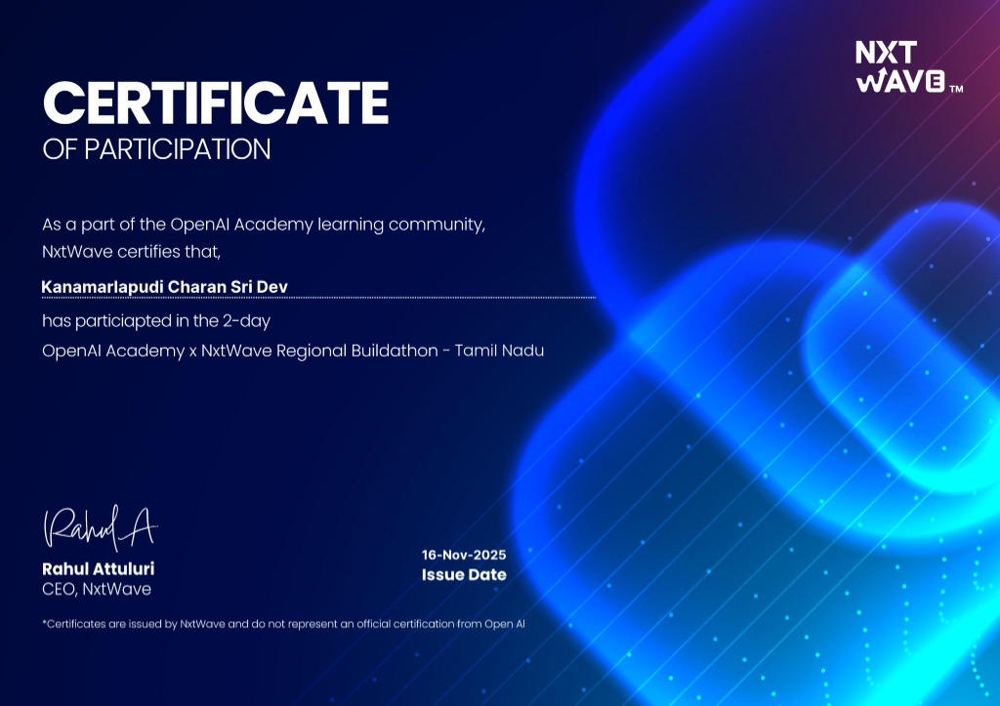

# 👁️ DrishtiFi (दृष्टि-Fi)

> **AI-Powered Digital Credit-Readiness Assessment for Informal & Offline MSMEs**

---

## 🚀 Live Demo & Deployment

This project was built and deployed using **Google AI Studio**:

👉 **[Access Live App on Google AI Studio](https://drishtifi.ai.studio/)**

---

## 🏆 Context & Buildathon Background

**DrishtiFi** was created for the **OpenAI Academy x NxtWave Regional Buildathon – Tamil Nadu** (a 2-day buildathon event jointly conducted by NxtWave / NxtWave Institute of Advanced Technologies as part of the **OpenAI Academy learning community**). 

This project represents the **Round 2 Submission** built by **Kanamarlapudi Charan Sri Dev**.

### 🌟 Why OpenAI Academy x NxtWave Buildathon?
The **OpenAI Academy x NxtWave Regional Buildathons** bring together top developer talent across regions to solve real-world socio-economic challenges using cutting-edge Generative AI and Multimodal LLMs. By combining advanced AI models with local impact vision, participants build practical applications that bridge digital and financial divides.

---

## 💡 The Problem & Why DrishtiFi is Useful

### The Problem
Millions of micro, small, and medium enterprises (MSMEs) and local *kirana* stores across India operate in the informal economy. They lack formal credit scores (like CIBIL), tax returns, or digitized banking transactions. When seeking business loans from banks or NBFCs, traditional underwriting models reject them due to a **lack of verifiable financial history**.

### The Solution: DrishtiFi
**DrishtiFi** ("Financial Vision") transforms raw physical visual evidence into formal, standardized financial creditworthiness assessments. 

By allowing small business owners or loan officers to capture just two photos:
1. **Shop Inventory / Physical Stock**
2. **Handwritten Sales & Credit Ledger (*Khaata* notebook)**

DrishtiFi's multimodal AI agent evaluates the physical stock density, reads handwritten entries, estimates cash flows, assesses stock turnover, generates a **Digital Credit-Readiness Report**, and recommends viable micro-loan amounts with transparent rationale.

---

## ✨ Key Features

- 📸 **Dual-Visual Analysis**: Combines inventory stock inspection with OCR & structured extraction of handwritten ledger notebooks (*Khaata*).
- 📊 **Trust Score & Risk Categorization**: Computes credit-worthiness grades (e.g., A, B+, C) and risk flags (Low Risk / Medium Risk / High Risk).
- 💰 **Automated Financial Estimation**: Estimates total inventory valuation (in ₹ INR), estimated daily sales, and monthly turnover alongside confidence ratings.
- 📋 **Executive & Rationale Reports**: Generates formal, bank-grade PDF/print-ready reports including positive business indicators, potential risks, and suggested loan limits.
- 🔒 **User Authentication & Dashboard**: Track, manage, and review historic credit assessment reports per user account.
- 🌗 **Responsive Modern UI**: Supports dark/light themes with intuitive micro-interactions and smooth user workflows.

---

## 🛠️ Technology Stack

- **Frontend**: React 19, TypeScript, Vite
- **AI Engine**: `@google/genai` (Gemini 2.5 Flash Multimodal Vision & Structured JSON Schema Outputs)
- **Styling**: Tailwind CSS / Modern CSS design tokens & icons
- **Authentication & Storage**: Firebase Web SDK / Local Storage mock service

---

## 🚀 How to Set Up & Run

### Prerequisites
- [Node.js](https://nodejs.org/) (v18 or higher recommended)
- A Gemini API Key from [Google AI Studio](https://aistudio.google.com/)

### 1. Clone the Repository
```bash
git clone https://github.com/charansridev/DrishtiFi.git
cd DrishtiFi
```

### 2. Install Dependencies
```bash
npm install
```

### 3. Configure Environment Variables
Create a `.env` or `.env.local` file in the root directory and add your API key:
```env
API_KEY=your_gemini_api_key_here
```

### 4. Start the Development Server
```bash
npm run dev
```

Open your browser and navigate to `http://localhost:5173` (or the URL outputted by Vite).

---

## 📜 Certificate of Participation

<div align="center">
  
  <p><em>Issued to <strong>Kanamarlapudi Charan Sri Dev</strong> for participating in the 2-day OpenAI Academy x NxtWave Regional Buildathon – Tamil Nadu (16-Nov-2025).</em></p>
</div>

